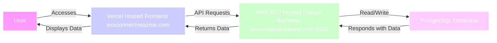

# Emory Connect Documentation

## Introduction

### Overview

Emory Connect is a collaborative platform designed to facilitate interaction and cooperation among users by allowing them to store, display, and share their projects. It incorporates a unique matching system based on user skills to help users find potential collaborators who have the needed competencies to make an efficient team to build projects.

### Purpose

The main goal of Emory Connect is to provide a medium for computer science students to find and connect with collaborators. This is achieved by highlighting individual skills, thereby promoting effective networking and community engagement.

The main goal of Emory Connect is to provide a medium for computer science students to find and connect with collaborators. This is achieved by highlighting individual skills, thereby promoting effective networking and community engagement.

### Target Audience

Emory Connect is mostly aimed at students who are seeking to collaborate on a wide range of projects, from academic research to personal and community initiatives.

Emory Connect is mostly aimed at students who are seeking to collaborate on a wide range of projects, from academic research to personal and community initiatives.

## Using Emory Connect

### Accessing the Platform

Emory Connect is accessible through any modern web browser. Users can interact with the platform online without the need for local installations. Here are the steps to access the platform:

1. **Visit the Website**: Open your web browser and navigate to the Emory Connect website at `https://www.ecsconnectneazme.com/`.
2. **Sign In**: Users can sign in if they already have one to access the platform's features.
3. **Sign Up**: Users can sign up by clicking the `Switch to Sign Up` button. Upon making an account, they will be guided through a tutorial to introduce them to the interface.

### Navigating the Interface

Upon logging in, users will find the following main sections:

- **Home**: Provides a quick overview of ongoing projects where user can add their projects and contributors.
- **Profile**: Here users can edit their profile and also add their skills, which will be displayed to their matches.
- **Matches**: This section uses the platform's matching algorithm to suggest potential collaborators based on the skills of the user.
- **Home**: Provides a quick overview of ongoing projects where user can add their projects and contributors.
- **Profile**: Here users can edit their profile and also add their skills, which will be displayed to their matches.
- **Matches**: This section uses the platform's matching algorithm to suggest potential collaborators based on the skills of the user.
- **Skills**: Users can update their skills inventory and specify what skills they are looking to find in potential collaborators.
- **Friends**: Users can add their friends by username. Once accepted, they can view their friends' profiles and projects.

### Creating a Project

To create a new project:

1. Navigate to the `Projects` section.
2. Click on `Create New Project`.
3. Fill in the project details such as the title, description, URLS, and then once created add contributors by username.

### Adding Skills

To begin adding your skills:

1. Navigate to the `Profile` page.
2. There you will see your profile on one side and the view of your skills on the other.
3. From their click `Add skills`.
4. There are 4 categories: DB are skills related to databases, Lang are programming-based languages, Exp are skills related to different fields that one may have experience in, and Pers are personal skills.
1. Navigate to the `Profile` page.
2. There you will see your profile on one side and the view of your skills on the other.
3. From their click `Add skills`.
4. There are 4 categories: DB are skills related to databases, Lang are programming-based languages, Exp are skills related to different fields that one may have experience in, and Pers are personal skills.

### Start Matching

To Begin Matching:

1. To ensure the best matching be sure to have your profile fully updated along with skills.
2. From there go to the 'Matching' page and on the loading page under `Find Matches`, our matching algorithm will begin and present the user with their top 3 matches.
3. From here you can send requests to that person to then match with them.
4. `Pending Matches` is where all match requests will display for you to accept.
5. `Matched Profiles` is where the people who have accepted your matches will display. Their profile and contact information will also display for you to contact and begin collaborating.

### Adding Friends

To begin adding friends:

1. Go to the 'Friends' page.
2. From here all your friends will be displayed and you can click their names to view their profiles. Then in their profile, you can click `view projects` to view their projects along with collaborators.
3. To get more friends simply click `Find friends` and search for users with their username and send requests by clicking the button next to their name to then send a friend request.

1. Go to the 'Friends' page.
2. From here all your friends will be displayed and you can click their names to view their profiles. Then in their profile, you can click `view projects` to view their projects along with collaborators.
3. To get more friends simply click `Find friends` and search for users with their username and send requests by clicking the button next to their name to then send a friend request.

## Technical Documentation

## Frontend 

### main page 

The main page contains the base layout (located in the LayOuts folder) for all of our pages. This base layout contains tabs at the top of that redirects the user to different pages: Home, Matching, Friends, Skills & Profile, and Settings. 
The main functionality of the front page is the ability for a user to add projects to their portfolio. An axios put method is used to update and store these projects in the user's database in the backend. Other axios methods allow for the user to add contributors to their projects or even delete their whole project. 

#### Notifications
The main page layout also includes a notifications tab that has matching and friend request notifications and redirects users to the related page when viewing the notification.

### Profile 
In the profile page, the user can edit their full name, major, include a GitHub URL, and their bio. All of this is updated and fetched, to and from the backend, with an axios get and axios put method. Another axios method is also used to update the skills in the backend whenever the user makes a change there. 

### Settings 
Here, the user can change their password. A local storage constant used as an authentication token is used to verify the user and axios is able to retrieve that user's old password and make changes to the backend to update the new password

### Matching 

Three apps were created to deploy all the utilities of Match. In all the apps, a Profile component is used to have a base design for a matched user's profile. 
The first app is startMatching. Within the startMatching file, we utilize an algorithm that matches users based on the similarity of another person's skill to the skills you are seeking. An axios method fetches the skills of users in the backend/database and the user receives the top three highest score that measures compatibility. 
The second app is matches. Here, an axios method was used to pull any match status saying "accepted" with the user from the backend. Additionally, another axios method was used to fetch the skills and email of these users. 
The third app is match-requests. Here, an axios method was used to fetch any match status, "pending," involving the user so that it shows all the user's match requests. Two more axios method was implemented, which is linked to an accept or decline button so that the function of accepting or declining the match request is stored/performed in the backend. 
All of these apps are neatly formatted into one matches file that contains all three of these apps as tabs on one page in the matching folder. 

### Friends 

Two apps were created to deploy all the utilities of the Friends function. 
The first app is find_friends. Here, an axios method was used to fetch all users that aren't currently friends with the user. This shows up in the frontend as a searchbar where the user can search for a friend to add. An axios method was also used to fetch the user's friend requests from the backend. This friend request is displayed to the right of the search bar
The second app is friendsList. Here, an axios method is used to retrieve all of the user's current friends. Another axios method is used to pull the friends' profiles so that they are viewable upon clicking on their name. All of this is displayed as a flex-box at the center of the webpage where the user can see their friends list. At the bottom of the friends list, the user has the option to click on Find Friends, where they will be redirected to the first app: "find_friends." 

## PostgreSQL

We used a Postgre database that's hosted on Amazon RDS through our virtual environment and Djangoproject settings where we have the database's credentials for access to contributors. We utilized the SQLs eazy write and read functions through our models to create tables that correlated with each user's credentials for easy retrieval for all of our apps.

## Backend

Our Backend is created on Django a Python web framework that uses the model-template-views architecture and we all created one virtual environment that stores all requirements needed to begin making contributions

### How Apps Work

Each major Django component would be considered an app. The necessary components for a functioning app include a URL specific to each app to access. This URL can be used for interaction either locally or when hosted. Afterwards, these URLs can be imported into the main project folder's settings and URLs. This enables access to the apps through the frontend. The following are our Django apps: Django_Proj, Authentication, FriendsSystem, Skills, User Projects, and Matches. 

### Django_Proj

This is the main overview folder for our Django project this is where all imports are stored like premade models as well as where we import our own apps and models to then use through URLS either locally hosted or online

### Authentication

This is the first app created in our project it utilizes the Django rest framework to create a Usermodel that we can then manipulate to our needs. This app with its framework came with Django and gives us the ability to allow users to make accounts and sign in to our servers through token-based authentication that we give and all their info such as username is stored in our PostgreSQL database.

### Matches

This app includes all the functionality to matching: send matches, decline matches, store deleted matches (so that a user doesn't get them again) and view match requests. A Match model was created to store every current match with the status of either "accepted" or "declined." Through this model, a serializer is created which allows the creation of each match instance. This app also includes the minor functionalities for matching related notifications: handling notifications for pending matching requests and handling notifications for accepted match requests.

### FriendsSystem

This is our friends app created inside our project. This app includes the following major functionalities: send friend request, decline friend request, remove friend, and view friend request. A Friend model was created to store each friend instance. Another model called Friend requests was created to store user's existing friend request.  This app also includes the minor functionalities for friend related notifications: handling notifications for pending friend requests and handling notifications for accepted/rejected friend requests.

### Skills

This app is how we do the matching. We created a model that's user-specific where each user has 2 skill sections: skills they have and skills they're looking for. Each section has four arrays for the different skill categories. Through our model, we make a serialize that allows users to add skills from our db of skills to each category and they can add and remove as they please to either section. Once they send or delete the skill we store it on the backend and then run our matching algorithm on those skills to return their matches.

### User projects

This app is where we created a model that creates a one-to-many relationship with user projects. Here one user can create many projects. In the model, we gave users 4 fields they can add to their project Title, Description, Github, and the contributors on it. Also in the background, we store IDs for each project that tie them to a user so we can retrieve each project for a user specifically. We use a serializer to then manipulate the Python to json how it shows on our frontend and how users will interact.

## Backend Hosting 
The backend is hosted on an EC2 instance with an established SSL certificate for the backend domain (ecsconnectbackend.com), and is updated regularly in accordance with commits related to the backend. The domain is registered under GoDaddy but the name servers have been changed to point to the EC2 instance's address and necessary AWS servers. In order for this to work with the django server, this uses a combination of nginx and an open source package (django-sslserver) on port 8000 to allow https traffic using that SSL cert. The certificate is kept locally on this instance to maintain the security of the fullchain and key information.

## Frontend Hosting 
Our Project utilizaed Next.js for the frontend this gave us a easy transition into hosting on the web with Vercel. Vercel allows hosting for Next.js simply by connecting to our Github Repo and Frontend Folder and renders the entire project and updates automatically with commits to the frontend

### System Architecture

Below is an architecture diagram illustrating the major components of Emory Connect and their interactions:

